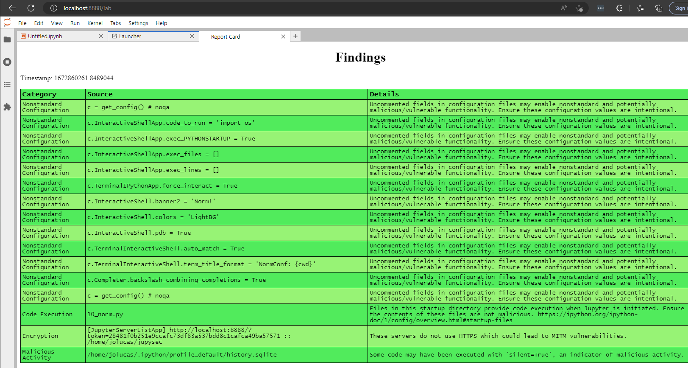

# jupysec

[](https://mybinder.org/v2/gh/JosephTLucas/jupysec/main?urlpath=lab)


_JupyterLab Security Utilities_

Security utilities for Jupyter environments. This extension evaluates the security posture of the environment by comparing configuration values with best practices.

This extension is under active development and pre-alpha release.

## Function

Run the extension to generate an HTML report of the security configuration of your Jupyter instance and other Jupyter instances on your host.

Configurations will be compared against [these rules](https://github.com/JosephTLucas/jupysec/blob/dev/jupysec/rules.py).

These rules currently evaluate:

- Whether there are any executables in your ipython startup directories
- What lines of your configuration are nonstandard (uncommented)
- Whether your servers require tokens for authentication
- Whether your server and client are communicating over HTTPS
- Whether you are serving Jupyter to a broader domain than just localhost
- If silent commands have been run against your kernels

Some of these categories may have false-positives depending on your environment and use-case. However, users should monitor their environments and be aware of their security posture and any changes.

Matches against [the rules](https://github.com/JosephTLucas/jupysec/blob/dev/jupysec/rules.py) are referred to as "Findings" and displayed in the Report Card.



## Requirements

- JupyterLab >= 3.0

## Install

To install the extension, execute:

```bash
pip install jupysec
```

## Uninstall

To remove the extension, execute:

```bash
pip uninstall jupysec
```

## Troubleshoot

If you are seeing the frontend extension, but it is not working, check
that the server extension is enabled:

```bash
jupyter server extension list
```

If the server extension is installed and enabled, but you are not seeing
the frontend extension, check the frontend extension is installed:

```bash
jupyter labextension list
```

## Contributing

### Development install

Note: You will need NodeJS to build the extension package.

The `jlpm` command is JupyterLab's pinned version of
[yarn](https://yarnpkg.com/) that is installed with JupyterLab. You may use
`yarn` or `npm` in lieu of `jlpm` below.

```bash
# Clone the repo to your local environment
# Change directory to the jupysec directory
# Install package in development mode
pip install -e "."
# Link your development version of the extension with JupyterLab
jupyter labextension develop . --overwrite
# Server extension must be manually installed in develop mode
jupyter server extension enable jupysec
# Rebuild extension Typescript source after making changes
jlpm build
```

You can watch the source directory and run JupyterLab at the same time in different terminals to watch for changes in the extension's source and automatically rebuild the extension.

```bash
# Watch the source directory in one terminal, automatically rebuilding when needed
jlpm watch
# Run JupyterLab in another terminal
jupyter lab
```

With the watch command running, every saved change will immediately be built locally and available in your running JupyterLab. Refresh JupyterLab to load the change in your browser (you may need to wait several seconds for the extension to be rebuilt).

By default, the `jlpm build` command generates the source maps for this extension to make it easier to debug using the browser dev tools. To also generate source maps for the JupyterLab core extensions, you can run the following command:

```bash
jupyter lab build --minimize=False
```

### Development uninstall

```bash
# Server extension must be manually disabled in develop mode
jupyter server extension disable jupysec
pip uninstall jupysec
```

In development mode, you will also need to remove the symlink created by `jupyter labextension develop`
command. To find its location, you can run `jupyter labextension list` to figure out where the `labextensions`
folder is located. Then you can remove the symlink named `jupysec` within that folder.

### Packaging the extension

See [RELEASE](RELEASE.md)
