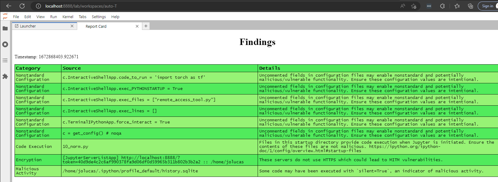

# jupysec


_JupyterLab Security Utilities_

Security utilities for Jupyter environments. This set of rules and JupyerLab extension evaluates the security posture of the environment by comparing configuration values with best practices.

## Function


Run the extension to generate an HTML report of the security configuration of your Jupyter instance and other Jupyter instances on your host.

Configurations will be compared against [these rules](https://github.com/JosephTLucas/jupysec/blob/dev/jupysec/rules.py).

These rules currently evaluate:

- Whether there are any executables in your ipython startup directories
- What lines of your configuration are nonstandard with known malicious uses
- Whether your servers require tokens for authentication
- Whether your server and client are communicating over HTTPS
- Whether you are serving Jupyter to a broader domain than just localhost
- If silent commands have been run against your kernels

Some of these categories may have false-positives depending on your environment and use-case. However, users should monitor their environments and be aware of their security posture and any changes.

Matches against [the rules](https://github.com/JosephTLucas/jupysec/blob/dev/jupysec/rules.py) are referred to as "Findings" and displayed in the Report Card.



## Requirements

- JupyterLab >= 3.0

## Getting Started

To install the rules in cli mode, execute:

```bash
pip install jupysec
```

Then in your python environment:

```python
from jupysec.rules import Rules

Rules().get_findings()
```

Or install the JupyterLab extension with

```bash
pip install jupysec[jupyterlab]
```

After starting jupyterlab, your launcher window should now have a "Security" section with a widget for generating your findings. This will launch and index page with a list of all findings, color-coded by category. Click into findings for more details.